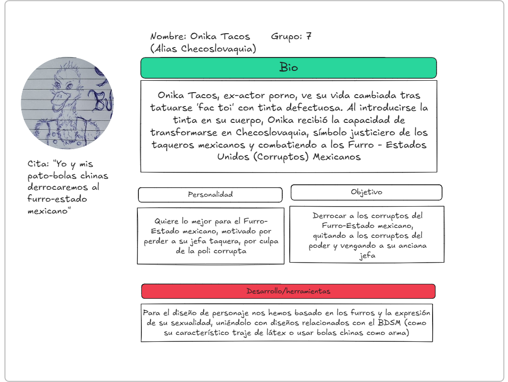

# Proyecto Storytelling: 
### Onika Tacos
Soy Onika Tacos, y esta es mi historia. El día en que quise tatuarme la palabra "fuc toi" en el culo, ocurrió algo inesperado. La tinta defectuosa, entró en mi organismo y me dotó de capacidades físicas extremas. Yo me dedicaba a la venta de tacos en un puesto ambulante, trabajando para la dueña de este establecimiento, Chesco, una mujer checoslovaca. Hasta que un día, la policía corrupta de mi corrupto país, la atacó sin miramiento y sin que pudiera defenderse. Desde entonces, tomé otra identidad con un nuevo nombre, Checoslovaquia (en honor a ella), y ahora me dedico a enfrentarme al gobierno corrupto de los Furro-Estados Unidos Mexicanos, con mis nuevas habilidades, y con mi indumentaria apretada de mi antigua vida como actor porno.

Autores:  
<!--- Incluir lista de personas del grupo. Se puede añadir enlace a página personal de github o lo que se quiera...(optativo)-->

- 🌮: Jaime Torres Sarmiento
- 🌮: Juan de Dios Cerezo García
- 🌮: Ismael Atli Peña
- 🌮: Jose Miguel López Cebral

Proyecto (código): 
URL (link) del proyecto en Github: https://github.com/atpe208/onika_tacos

Tipo/Género:  
- [ ] FictionCiberpunk  
- [ ] Reality/tribus urbanas  
- [x] Comic

## Resumen
Onika Tacos, ex-actor porno, ve su vida cambiada tras tatuarse 'fac toi' con tinta defectuosa. Al introducirse la tinta en su cuerpo, Onika recibe la capacidad de transformarse en _Checoslovaquia_, símbolo justiciero de los taqueros mexicanos y combatiendo a los Furro - Estados Unidos (Corruptos) Mexicanos.

### Personaje
**Nombre**: Onika Tacos (alias _Checoslovaquia_) 
 

 **Ficha de personaje:**

Ficha completa en Excalidraw: [excalidraw_onika.excalidraw](excalidraw_onika.excalidraw)

### Historia
Los Furros-Estados Unidos Mexicanos, es una nación en la que cada día que pasa, caen un poco más por el abismo de la locura. Comenzaron a precipitarse desde que el nuevo gobierno llegó al poder. Es tanta su decadencia, que ya son muchos los que llaman al país directamente Furro-Estados Unidos (Corruptos) Mexicanos. 
En la esquina de uno de los barrios más marginales, hay un pequeño local de tacos que alegra los corazones de todos los que entran. Su dueña, una mujer checoslovaca -Chesco, como la llamaba todo el mundo-, prepara con cariño cada taco; e incluso hasta a los más desdichados que no se pueden permitir ninguno (aun siendo muy baratos), disfrutan de suculentas comidas que ella les regala con mucho gusto. El problema es que su generosidad obtuvo fama, y la policía quiso aprovecharse de ella. Un día, dos agentes entraron en el local poco antes de la hora del cierre, exigieron tacos y remarcaron que estos fueran gratis. Ella era consciente de como actuaba la policía, no eran pocas las veces que sus clientes se quejaban mientras comían en el local. Chesco se plantó y les pidió que se fueran del local cordialmente. La respuesta de ellos en cambio fue _violencia_. Destrozaron el local y dejaron a Chesco mal herida y por suerte cuidada por sus vecinos que la encontraron apalizada a la mañana siguiente. Pero la policía no contó con la cosecuencia de sus actos; y esta consecuencia tenía un nombre: Onika Tacos.

Onika era un camarero que trabajaba con Chesco en el local (su apellido siempre fue Tacos, inclusos antes de trabajar aquí) y fue el primero en encontrarla tras el incidente. Onika era un pato antropomorfo de gran corazón aunque de cerebro pequeño. En su joven vida ya había tenido muchos y variados trabajos, debido a su torpeza ya famosa entre la gente. Sin embargo de todos sus trabajos, los dos de los que mejores recuerdos guarda son sin duda: su actual labor como camarero para Chesco, y su antigua profesión como actor porno de BDSM en películas amateurs. Pero desde hace un año guardaba un secreto. Antes de retirarse de la industria del porno, Onika se hizo un tatuaje en el trasero en el que ponía "Fuc Toi" (recalcamos, muy listo no es), estando "Fuc" en una nalga y "Toi" en la otra. Pero por razones que aun no comprende, la tinta defectuasa del pésimo local en donde se lo hizo, le provocó una extraño reacción. Entró en su organismo y le otorgó habilidades físicas extraordinarias, que despertaban cuando soplaba las plumas de sus pulgares. 

Intentó mantener en secreto sus nuevas capaciidades, pero el día que se encontró a Chesco en el suelo, decidió dar un nuevo sentido a su vida. Cogió su antiguo uniforme y los instrumentos sexuales de su vida pasada en el sado, y los convirtió en el traje y en las armas de un héroe. Ahora en cuanto tiene oportunidad, Onika se calza su traje de cuero apretado, su fusta y sus bolas chinas, y sopla sus plumas para despertar al superhéroe que tiene dentro. Onika sube, intentado no tropezarse, a las cornisas de los edificios más altos, y desde allí contempla una ciudad sin ley vestido con su nueva identidad: Checoslovaquia, en honor a Chesco, y por su nombre defenderá a los más débiles y se vengará del nuevo orden que maneja los Furros-Estados Unidos Mexicanos. Onika quiere ser un héroe, ahora deberá mostrar que es capaz de serlo y, más importante, si sus vecinos le quieren precisamente a él como héroe que los defienda. 

### TagLine
>_"Yo y mis pato-bolas chinas derrocaremos al furro-estado mexicano"_

### Conflicto 
Onika desea tener una vida tranquila, sin destacar y sólo haciendo lo que le guste. Pero la realidad de su entorno le atacó directa y personalmente, el día que la policía agredió, hasta casi matar, a su jefa. Onika no tiene ni idea de lo que es ser un héroe, pero hará todo lo que esté en sus manos para ser el mejor; aunque su traje sea la indumentaria de una estrella porno del sado. 

### Productos

- Personaje: (img personaje y enlace a interactivo) Pulsa abajo o escanea el QR para conocer más acerca de Onika! 👇 
 

### Conclusiones/Valoración del equipo
Como equipo hemos visto que con este trabajo, hemos evolucionado nuestra creatividad de formas insospechadas. Sin darnos cuenta, entre conversaciones sueltas con conceptos cada vez más alocados, florecía una historia estructurada y -aunque parezca que no por la premisa- seria. Al final hemos escrito y dibujado un personaje y una trama, que ojalá llegue a cobrar vida propia. Onika es nuestra criatura de Frankestein personal, quizás a alguno les asuste ver a esa alta anomalía, recubierta de plumas y de cuero (menos por las nalgas); pero para este equipo, es un bello animal que ha nacido gracias a las extremidades y las partes que les hemos dado cada uno de nosotros.

------

<!---
Lista completa de emojis de markDown - https://gist.github.com/rxaviers/7360908) 
-->

Marzo, 2026

Proyecto dentro de la serie [Narrativas interactivas](https://github.com/mgea/storytelling/blob/master/What_is_a_digital_storytelling.md) 
Proyectos seleccionados de [2023](https://github.com/mgea/storytelling/tree/master/2023), [2022](https://github.com/mgea/storytelling/blob/master/2022/readme.md) / [2021](https://github.com/mgea/storytelling/blob/master/2021/readme.md) / [2020](https://github.com/mgea/storytelling/blob/master/2020/readme.md)  / 
[2019](https://github.com/mgea/storytelling/blob/master/2019/readme.md) / [2018](https://github.com/mgea/storytelling/blob/master/2018/readme.md) 

CC BYNCSA [Creatividad e Innovación Audiovisual-B](https://github.com/mgea/criav/)

 

[Facultad de Comunicación y Documentación](http://fcd.ugr.es)

Universidad de Granada
